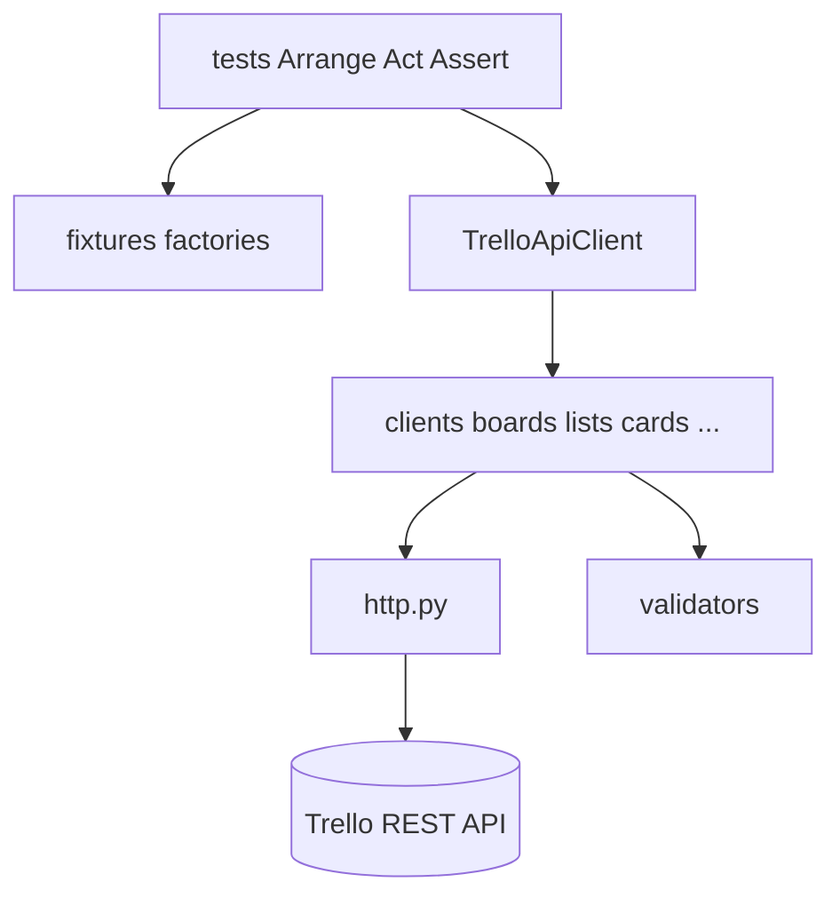

# trello_api

REST API-автотесты для **Trello**. Роль в дипломной экосистеме — **data provider**: создаёт сущности через API, переиспользуется в [trello_ui](https://github.com/shadow7971247/trello_ui) и [trello_mobile](https://github.com/shadow7971247/trello_mobile).

**Overview:** [trello](https://github.com/shadow7971247/trello) · **Архитектура:** [docs/ARCHITECTURE.md](https://github.com/shadow7971247/trello/blob/main/docs/ARCHITECTURE.md) · **CI:** [docs/CI.md](https://github.com/shadow7971247/trello/blob/main/docs/CI.md)

## Стек

- Python 3.12+
- Pytest, Requests, Pydantic v2, Allure, Faker, python-dotenv

## Архитектура решения



| Слой | Папка | Ответственность |
|------|-------|-----------------|
| Test | `tests/` | Сценарии, маркеры, проверки |
| Arrange | `fixtures/`, `conftest.py` | `prepare_*`, yield-фикстуры |
| Low Level | `api/client.py`, `clients/*` | HTTP-методы, `assert_status_code` |
| Контракты | `models/`, `api/validators.py` | Pydantic request/response |
| Engine | `api/http.py` | `requests` без auto-raise на 4xx |
| Config | `utils/config.py` | Только через фикстуру `app_config` |

Подробнее: [ARCHITECTURE.md](https://github.com/shadow7971247/trello/blob/main/docs/ARCHITECTURE.md).

## Структура

```
trello_api/
├── api/
│   ├── client.py          # фасад
│   ├── http.py
│   ├── endpoints.py
│   ├── assertions.py      # assert_equals, assert_status_code
│   ├── helpers.py         # parse_json, normalize_query_params
│   └── validators.py
├── clients/
│   ├── boards.py
│   ├── lists.py
│   ├── cards.py
│   ├── checklists.py
│   └── members.py
├── fixtures/
│   ├── factories.py       # prepare_board, prepare_list, ...
│   ├── generators.py      # board_name, card_name, ...
│   └── test_data.py
├── models/request|response/
├── tests/
├── utils/
├── conftest.py
└── pytest.ini
```

## Установка

```bash
git clone https://github.com/shadow7971247/trello_api.git
cd trello_api
python -m venv .venv
.venv\Scripts\activate          # Windows
pip install -r requirements.txt
copy .env.example .env
```

Заполните `.env`: `TRELLO_API_KEY`, `TRELLO_API_TOKEN` ([Trello Developer Keys](https://trello.com/app-key)).

## Запуск

```bash
pytest                          # все тесты (25)
pytest -m smoke                 # smoke для Jenkins (7)
pytest -m boards
pytest tests/test_cards.py -v
pytest --alluredir=allure-results && allure serve allure-results
```

### Smoke в CI (7 тестов)

| Тест | Что проверяет |
|------|---------------|
| `test_get_current_user` | GET /members/me |
| `test_create_board` | CRUD: создание доски |
| `test_create_public_board` | Публичная доска для UI |
| `test_create_list` | Список на доске |
| `test_create_card` | Карточка в списке |
| `test_create_checklist` | Чек-лист на карточке |
| `test_get_member_boards` | Доски участника |

### Данные для UI

```bash
pytest -m ui_setup              # artifacts/test-context.json
pytest -m ui_teardown           # очистка по контексту
```

## Покрытие

| Модуль | Сценарии |
|--------|----------|
| Auth | valid token, invalid token (401) |
| Boards | CRUD, public, close, без имени |
| Lists | create, get, rename |
| Cards | CRUD, move, archive |
| Checklists | checklist + checkitem |
| Members | boards, workspaces |

## Принципы

- Тонкие тесты: Arrange в фикстурах, Assert в тесте или через `assert_*`
- Негативные кейсы: `raw_request` + явный `assert_status_code(response, 404)` (не `in (404, 410)`)
- Без дублирования `config.py` в корне — только `utils/config.py`
- DRY: `fixtures/factories.py` вместо `try/finally` в тестах

## Troubleshooting

| Ошибка | Решение |
|--------|---------|
| `400 Workspaces are full` | Удалите старые тестовые доски в аккаунте Trello |
| `401` на smoke | Проверьте `TRELLO_API_KEY` / `TRELLO_API_TOKEN` |

## CI

Основной прогон — Jenkins [shadow7971247_trello_v2](https://jenkins.autotests.cloud/view/python_students/job/shadow7971247_trello_v2/), stage API: `pytest -m smoke`.

Лицензия: учебный проект QA Guru.
